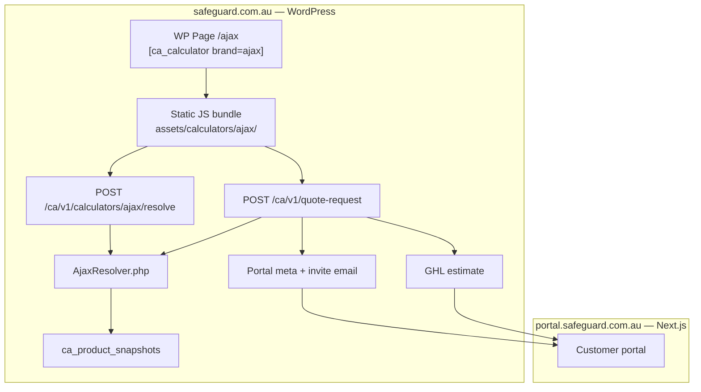

# Calculator Architecture Plan

**Status:** Approved direction (June 2026)  
**Audience:** Engineering (Tamim), product (Nafiz)  
**First implementation:** Ajax intrusion calculator  
**Related:** `next-app/public/prototypes/ajax-calculator.html`, `QuoteRequestController.php`, `ca_product_snapshots`

---

## 1. Executive summary

Safeguard will offer **multiple brand-specific calculators** (Ajax, Paradox, Hikvision/Dahua CCTV, etc.). Each has unique wizard questions and SKU mapping rules, but all share the **same outcome**: contact + priced line items → GHL estimate → customer portal.

**Decision:**

| Surface | Host | Responsibility |
|---------|------|----------------|
| **Public calculators** | Main WordPress domain (`safeguard.com.au`) | Short URLs, wizard UI, lead capture |
| **Customer portal + admin** | Portal subdomain (`portal.safeguard.com.au`) | Next.js — photos, accept, pay |
| **Backend** | `cheapalarms-plugin` (one plugin) | Resolve pricing, quote-request, GHL, portal meta |

**Critical security rule:** Prices are resolved **only in PHP** from product snapshots. The browser never sends or receives per-line amounts. Customers see **system subtotal only** (names + quantities on review).

**Not doing:** separate WordPress plugin per brand, calculator logic inside `PortalService.php`, calculators on the portal subdomain, client-trusted `items[].amount` for public submits.

---

## 2. Problem we are solving

1. **Multiple calculators** — each brand needs its own questions, packages, and device-counting rules.
2. **Short public URLs** — marketing links must be `safeguard.com.au/ajax`, not `portal.safeguard.com.au/calculators/ajax`.
3. **Headless WordPress** — WordPress remains the API and integration hub (GHL, Stripe, portal metadata); the portal app is Next.js on a subdomain.
4. **Price privacy** — sell at distributor RRP internally; customers see rolled-up totals, not per-device margin/RRP in the UI or network tab.
5. **Portal parity** — calculator-created estimates must match admin Quick Quote shape so photo missions, acceptance, and payment behave identically.

---

## 3. Domain and URL strategy

```
safeguard.com.au              portal.safeguard.com.au
─────────────────────         ───────────────────────────
/ajax          → Ajax calc     /portal  → customer area
/paradox       → Paradox calc  /admin   → staff
/wp-json/...   → REST API
```

| Phase | Customer action | URL |
|-------|-----------------|-----|
| Discover & configure | Uses calculator | `safeguard.com.au/ajax` |
| Submit quote | Same origin POST to WP REST | `safeguard.com.au/wp-json/ca/v1/...` |
| Photos & acceptance | Email link to portal | `portal.safeguard.com.au/portal?...` |

**Why calculators stay on the main domain**

- Short, shareable links (ads, SMS, QR).
- **Same-origin** calls to `/wp-json` — no CORS, no Next.js proxy hop for public quote flow.
- Portal subdomain reserved for authenticated / post-quote journey.

This matches the existing production layout documented in `wordpress/.../PRODUCTION-CONFIG-CHECKLIST.md` (WordPress = marketing + calculators; Next.js = portal).

---

## 4. High-level architecture



---

## 5. What lives where

### 5.1 WordPress plugin (`cheapalarms-plugin`)

| Component | Path (planned) | Language |
|-----------|----------------|----------|
| Shortcode registration | `includes/Calculators/CalculatorShortcode.php` | PHP |
| Brand resolvers | `includes/Calculators/Resolvers/AjaxResolver.php`, etc. | PHP |
| Resolve REST controller | `includes/REST/Controllers/CalculatorController.php` | PHP |
| Resolve token store | WordPress transients (15 min TTL) | PHP |
| Built calculator assets | `assets/calculators/{brand}/` | JS + CSS (built) |
| Shared client helper | `assets/calculators/shared/submit.js` | JS |
| Pricing source | `ProductSnapshotRepository` → `wp_ca_product_snapshots` | PHP / DB |
| Quote + portal pipeline | Existing `QuoteRequestController` (extended) | PHP |

Structure as a **self-contained module** (`includes/Calculators/` + `assets/calculators/`) so it can become its own plugin later without surgery — but **start inside one plugin**.

### 5.2 Next.js (`next-app`)

| Component | Role |
|-----------|------|
| `/portal` | Customer estimate view, photos, accept/reject |
| `/admin` | Quick Quote, estimate management |
| `/api/quote-request` | Proxy for **dev/test pages only** — production calculators call WP directly |

**Calculators are not built in Next.js** for production public URLs.

### 5.3 What we explicitly avoid

- Calculator wizards in `PortalService.php` (6k+ lines, high-risk).
- One WordPress plugin per brand.
- Putting public calculators on the portal subdomain.
- Trusting `items[].amount` from the browser on public `quote-request`.

---

## 6. Languages and build tooling

| Layer | Technology | Notes |
|-------|------------|-------|
| Wizard UI | **JavaScript** (React optional via Vite) | UX only — selections, validation, contact form |
| Build | **Vite** → static bundles | Output to `assets/calculators/{brand}/` |
| SKU mapping + pricing | **PHP** | Reads snapshots; never exposed per-line to client |
| Config (v1) | PHP arrays or JSON loaded by resolver | Boss SKU swaps without touching wizard UI |
| Embed | **WordPress shortcode** | Marketing controls page slug / SEO |

**Decide at Ajax v1:** Vite static bundles (recommended over raw single HTML file) so wizard logic can grow with modules/components without rot.

**Prototype today:** `next-app/public/prototypes/ajax-calculator.html` — reference UX only; production moves to plugin assets after build setup.

---

## 7. Embedding on a WordPress page

### 7.1 Admin setup

1. Create page **Ajax Alarm Quote**.
2. Set slug to `ajax` → public URL `https://safeguard.com.au/ajax`.
3. Add shortcode to page body:

```
[ca_calculator brand="ajax"]
```

### 7.2 What the shortcode outputs

```html
<div id="ca-calculator" data-brand="ajax"></div>
<script src=".../assets/calculators/ajax/calculator.js" defer></script>
<link rel="stylesheet" href=".../assets/calculators/ajax/calculator.css" />
```

The JS app mounts on `#ca-calculator` and runs the full wizard.

### 7.3 Future brands

| Brand | Page slug | Shortcode |
|-------|-----------|-----------|
| Ajax | `/ajax` | `[ca_calculator brand="ajax"]` |
| Paradox | `/paradox` | `[ca_calculator brand="paradox"]` |
| CCTV | `/cctv` | `[ca_calculator brand="hikvision"]` (or combined) |

All are **product-line calculators on one Safeguard install** — not separate businesses or plugins.

---

## 8. API design

### 8.1 Principle: selections in, subtotals out

```
Browser                          Server (PHP)
───────                          ────────────
selections only        ───────►  resolve + price from snapshots
subtotal + summary     ◄───────  (no per-line amounts)
selections or token    ───────►  re-resolve + GHL estimate
success                ◄───────  (still no line prices)
```

**Prices never leave PHP.** UI hiding prices is insufficient if `resolve` or `quote-request` returns or accepts priced line items from the client (devtools / network tab).

### 8.2 `POST /ca/v1/calculators/{brand}/resolve`

**Purpose:** Preview totals during wizard (review step) without exposing unit prices.

**Request (example — Ajax custom build):**

```json
{
  "path": "custom",
  "propertyType": "house",
  "storeys": "1",
  "doors": 2,
  "windows": 0,
  "motionRooms": 3,
  "hasKeypad": true,
  "hasIndoorSiren": true,
  "hasOutdoorSiren": true,
  "remotes": 0
}
```

**Request (example — package):**

```json
{
  "path": "package",
  "packageId": "kit_12222",
  "addKeypadToUpgrade": false
}
```

**Response (customer-safe):**

```json
{
  "ok": true,
  "hardwareSubtotal": 1998.00,
  "installEstimate": 450.00,
  "total": 2448.00,
  "currency": "AUD",
  "summary": [
    { "name": "Ajax Hub 2 (4G) Jeweller — White", "qty": 1 },
    { "name": "Ajax MotionProtect — Indoor PIR White", "qty": 3 },
    { "name": "Ajax DoorProtect — Door contact White", "qty": 2 }
  ],
  "resolveToken": "rt_a1b2c3d4e5f6"
}
```

**Must NOT include:** `amount`, `unitPrice`, `sku`, `lineTotal`, or full GHL `items[]` in the browser response.

**Server-side:** `resolveToken` stores canonical selections in a transient (recommended TTL: **15 minutes**). Optional: store a hash of resolved snapshot version for staleness detection.

**Rate limiting:** Apply public rate limit (same family as `quote_request_public`).

### 8.3 `POST /ca/v1/quote-request` (calculator mode)

**Existing endpoint** — extend to accept calculator submissions **without client-priced items**.

**Calculator request (preferred — token):**

```json
{
  "firstName": "Muhammad",
  "lastName": "Tamim",
  "email": "customer@example.com",
  "phone": "0412345678",
  "brand": "ajax",
  "resolveToken": "rt_a1b2c3d4e5f6"
}
```

**Calculator request (alternative — inline selections):**

```json
{
  "firstName": "Muhammad",
  "lastName": "Tamim",
  "email": "customer@example.com",
  "phone": "0412345678",
  "brand": "ajax",
  "selections": {
    "path": "custom",
    "doors": 2,
    "motionRooms": 3
  }
}
```

**Server behaviour:**

1. Load selections (from token or body).
2. Call brand resolver → `toLineItems(selections)` using **current** product snapshots.
3. Build GHL estimate items (name, amount, qty, currency, taxInclusive, photo hints).
4. Continue existing flow: GHL contact → estimate → WP user → portal meta → invite email.
5. Return success **without** echoing per-line prices to the client.

**Legacy / admin path:** `items[]` with amounts remains for admin Quick Quote and internal test page (`next-app/src/pages/quote/index.js`) — **not** for public calculator submits. Consider requiring a server-only flag or separate authenticated route for trusted item payloads.

### 8.4 Shared resolver interface (PHP)

Each brand implements the same contract:

```php
interface CalculatorResolverInterface
{
    /** Validate selections; return WP_Error on invalid input */
    public function validate(array $selections): true|\WP_Error;

    /** Map selections → priced line items for GHL (server only) */
    public function toLineItems(array $selections): array;

    /** Customer-safe summary (names + qty only) */
    public function toSummary(array $selections): array;

    /** Install estimate (inc GST) */
    public function installEstimate(array $selections, array $lineItems): float;
}
```

`CalculatorResolverRegistry` maps `brand` string → resolver class.

---

## 9. Pricing and product snapshots

### 9.1 Source of truth for RRP

- **v1:** Dicker / distributor RRP stored in `wp_ca_product_snapshots` (synced from GHL catalog or manual seed for distributor SKUs not in GHL).
- Resolver maps **logical slots** (hub, motion, door_sensor, …) → snapshot `product_id` / SKU via brand config.
- Sell price = snapshot RRP (inc GST) unless boss configures otherwise later.

### 9.2 Brand config (example — Ajax)

Stored as PHP config or JSON under `includes/Calculators/Config/ajax.json`:

```json
{
  "brand": "ajax",
  "slots": {
    "hub": { "snapshotSku": "000000122", "fallbackName": "Ajax Hub 2 (4G) Jeweller — White" },
    "motion": { "snapshotSku": "000000130", "fallbackName": "Ajax MotionProtect — Indoor PIR White" },
    "door_sensor": { "snapshotSku": "000000128", "fallbackName": "Ajax DoorProtect — White" }
  },
  "packages": {
    "kit_12222": { "dickerSku": "12222", "sellIncGst": 1998, "bom": ["hub", "keypad", "motion×3", "indoor_siren", "outdoor_siren"] },
    "kit_wired_upgrade": { "dickerSku": "AX-WU-K1", "sellIncGst": 1398 }
  },
  "rules": {
    "hubModel": "Hub 2 (4G)",
    "colour": "white",
    "doorsMin": 1,
    "motionMin": 1,
    "customerSeesLinePrices": false
  }
}
```

Boss SKU changes = config update + deploy (v2: admin UI to edit config).

### 9.3 Install pricing

- **v1 assumption:** base install $450 + $35 per additional device (configurable per brand).
- Shown to customer as separate line on **subtotal block** (install is not hidden — only per-hardware unit prices are).

---

## 10. Ajax v1 product rules (provisional — boss sign-off pending)

| Rule | Value |
|------|-------|
| Hub | Ajax Hub 2 (4G) only |
| Colour | White only |
| Door mapping | 1 door → 1 door contact; minimum 1 door |
| Window mapping | 1 window → 1 contact; optional |
| Motion mapping | 1 room/hallway → 1 indoor PIR; minimum 1 |
| Pricing | Dicker RRP (inc GST) via snapshots |
| Customer display | System hardware subtotal + install + total; **no per-line prices** |
| Paths | Custom build, package **12222**, package **AX-WU-K1** (+ optional keypad on upgrade) |
| Output | GHL **estimate** + customer portal (not GHL Documents & Contracts) |

**Packages**

| ID | Dicker SKU | Description | Package RRP (inc GST) |
|----|------------|-------------|------------------------|
| `kit_12222` | 12222 | Hub 2 4G, keypad, 3× PIR, HomeSiren, StreetSiren | $1,998 |
| `kit_wired_upgrade` | AX-WU-K1 | Wired-to-wireless module + battery | $1,398 |

Reference UX: `next-app/public/prototypes/ajax-calculator.html`.

---

## 11. Customer journey (end-to-end)

```
1. Customer visits safeguard.com.au/ajax
2. Completes wizard (selections only in browser)
3. Review step calls /resolve → sees names, qty, hardware subtotal, install, total
4. Enters contact details → POST /quote-request with resolveToken
5. Server re-resolves prices → creates GHL estimate → portal meta → email
6. Success screen: "Check your email for your portal link"
7. Customer opens portal.safeguard.com.au → uploads photos per device
8. Staff reviews → customer accepts → payment (existing portal flow)
```

**Cross-domain handoff** (main site → portal subdomain) is intentional. Success copy should set expectation: *email contains portal link*, not *stay on this page*.

---

## 12. Estimate shape and portal parity

Calculator-created estimates must produce the same structures as admin Quick Quote:

| Field | Requirement |
|-------|-------------|
| GHL line items | name, amount, qty, currency, taxInclusive |
| `itemHints` / `itemsMeta` | `photoRequired`, `isPackage`, `isHeading` where applicable |
| Package rows | Package as heading; children as photo targets (see `next-app/src/pages/quote/index.js` seed pattern) |
| Portal photo checklist | Auto-hide package headings; show photo missions per device |

**Contract test:** Submit Ajax calculator in staging → verify portal Overview shows line items, photo missions, and subtotal behaviour matches Quick Quote-created estimate.

---

## 13. Security and abuse prevention

| Control | Status / plan |
|---------|----------------|
| Rate limit on `quote-request` | Exists (`quote_request_public` in `QuoteRequestController`) |
| Rate limit on `/resolve` | **Add** before Ajax goes live |
| Email duplicate lock | Exists (60s transient per email) |
| Honeypot field on contact form | **Add** in shared `submit.js` |
| reCAPTCHA / Turnstile | **Consider** before production marketing traffic |
| Server-side price resolution | **Required** — no client `amount` |
| Resolve token TTL | 15 minutes; single-use optional on quote submit |

Public submit creates GHL contacts + WP users — treat as spam-sensitive from day one.

---

## 14. Frontend module structure (Vite)

```
cheapalarms-plugin/
  calculators-src/           # dev source (not loaded by WP directly)
    ajax/
      main.jsx
      steps/
      api.js                 # fetch resolve + quote-request
    shared/
      submit.js
      wizard-shell.js
  assets/calculators/        # build output (committed or CI artifact)
    ajax/
      calculator.js
      calculator.css
    shared/
      submit.js
```

**Build command (planned):** `npm run build:calculators` from plugin or monorepo root.

**Client `api.js` responsibilities:**

- `resolve(selections)` → display subtotals + summary
- `submitQuote({ contact, resolveToken })` → POST quote-request
- Never parse or display per-line amounts from any response

---

## 15. Multi-brand rollout

| Order | Brand | Notes |
|-------|-------|-------|
| 1 | **Ajax** | Sets pattern: resolver, shortcode, Vite build, resolve token |
| 2 | **Paradox** | New resolver + config; likely hardwired vs wireless profiles |
| 3 | **Hikvision / Dahua** | Different question set (NVR, cameras); same API contract |

**Defer until second calculator:**

- Shared “calculator core” wizard framework (abstract only when duplication is real).
- Splitting calculators into a separate WordPress plugin.
- Shared npm package across repos.

**Do now (Ajax):**

- Server resolution contract
- Vite build tooling
- Page + shortcode URL mechanism
- Spam protection on public submit
- Brand config isolation (`ajax.json` / `AjaxResolver.php`)

---

## 16. GHL Documents vs Estimates

| GHL type | Use today |
|----------|-----------|
| **Estimate** (`/invoices/estimate`) | **Automated** — `QuoteRequestController`, portal, acceptance |
| **Documents & Contracts** | Manual large proposals (e.g. $10k–$150k jobs) — **not automated** |

Calculator v1 creates **GHL estimates** and opens the **portal**. Formal proposal documents remain a manual or phase-2 integration if required.

---

## 17. Implementation phases

### Phase 0 — Done / in progress

- [x] Ajax HTML prototype (`next-app/public/prototypes/ajax-calculator.html`)
- [x] Product snapshots table + sync (`ca_product_snapshots`)
- [x] Public `quote-request` pipeline (contact → GHL → portal invite)
- [x] Rate limiting on `quote-request`

### Phase 1 — Ajax foundation

- [ ] `includes/Calculators/` module scaffold
- [ ] `AjaxResolver.php` + `ajax.json` config
- [ ] `POST /ca/v1/calculators/ajax/resolve` with token + customer-safe response
- [ ] Extend `quote-request` for `brand` + `resolveToken` / `selections` (server re-resolve)
- [ ] `[ca_calculator brand="ajax"]` shortcode
- [ ] Vite build → `assets/calculators/ajax/`
- [ ] WP page at `/ajax`
- [ ] Honeypot + resolve rate limit
- [ ] Staging E2E: calculator → email → portal photos

### Phase 2 — Hardening

- [ ] Boss SKU / RRP sign-off wired into config
- [ ] Snapshot sync covers all Ajax slot SKUs
- [ ] Contract test vs Quick Quote estimate shape
- [ ] Optional Turnstile on contact step

### Phase 3 — Paradox

- [ ] `ParadoxResolver.php` + `/paradox` page
- [ ] Extract shared `submit.js` only if copy-paste hurts

---

## 18. Open questions (boss sign-off)

| Item | v1 assumption |
|------|----------------|
| Exact Dicker SKU per slot | Best match from kit 12222 + intrusion list |
| Install fee formula | $450 base + $35/device |
| Show install to customer? | Yes (as subtotal line) |
| Monitoring monthly | Not on calculator v1 |
| AX-WU-K1 stock / lead time | Show package; note if out of stock |
| GHL Documents for large jobs | Manual; out of calculator scope |

---

## 19. Key file references

| File | Role |
|------|------|
| `wordpress/.../QuoteRequestController.php` | Public quote pipeline (extend for calculator mode) |
| `wordpress/.../ProductSnapshotRepository.php` | Local product/RRP reads |
| `wordpress/.../EstimateService.php` | GHL estimate creation |
| `wordpress/.../PortalService.php` | Portal meta, itemsMeta, invite email |
| `wordpress/.../RateLimitHeaderMiddleware.php` | Rate limit config per route |
| `next-app/public/prototypes/ajax-calculator.html` | UX reference prototype |
| `next-app/src/pages/quote/index.js` | Dev test quote page (legacy items[] path) |
| `docs/COMPLETE-ESTIMATE-WORKFLOW.md` | Portal journey after estimate |
| `wordpress/.../PRODUCTION-CONFIG-CHECKLIST.md` | Domain layout |

---

## 20. Decision log

| Date | Decision |
|------|----------|
| 2026-06 | Calculators on **main WP domain**; portal on subdomain |
| 2026-06 | **One plugin** (`cheapalarms-plugin`); module `includes/Calculators/` |
| 2026-06 | Wizard in **JS (Vite)**; pricing in **PHP** from snapshots |
| 2026-06 | Embed via **WP page + shortcode** for short URLs |
| 2026-06 | **Selections/token** to quote-request; never client-priced items |
| 2026-06 | Customer sees **subtotal only**; no per-line prices in API responses to browser |
| 2026-06 | Ajax first; Paradox reuses pattern |

---

*Last updated: June 2026*
